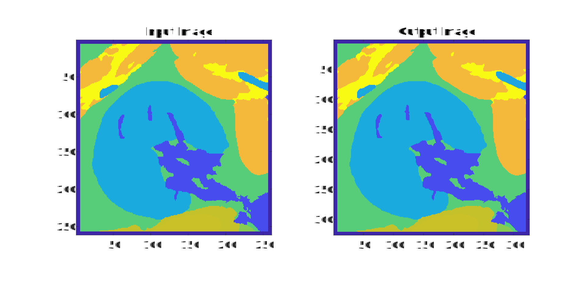

# Segmentation Upsampler

This is a Python-based software for upsampling 3-dimensional segmented medical images using a mesh-based method. This method may be useful for reducing staircasing artifacts and increasing accuracy in medical image-derived ultrasound simulations.

## Installation

*The software is Python-based and MATLAB is used to generate sample shapes and run tests.

The software was developed in following environment:\
Python version 3.9\
MATLAB R2023b\
Please check the compatibility of lateral Python versions using this link: https://www.mathworks.com/support/requirements/python-compatibility.html.

Python package Installation:\
pip install numpy scipy vtk numba

MATLAB package:\
k-Wave (http://www.k-wave.org/)

## Examples

[example_multilabel_testobject.m](https://github.com/ucl-bug/segmentation-upsampler/blob/main/example_multilabel_testobject.m) upsamples a code-generated complex shape and compares it to a high-resolution code-generated ground truth.

[example_vertebra.m](https://github.com/ucl-bug/segmentation-upsampler/blob/main/example_vertebra.m) resamples a medical image-based segementation of a human spine. Figure 1 depicts slices through the 3D spine volume, demonstrating the upsampling of a multi-label spine segmentation with input parameters $\sigma = 0.7$ and isovalue = 0.4. The input image is sourced from Liebl $et$ $al$. 2021 [^1]. This demonstration resamples the original anisotropic voxel spacing of [0.2910, 0.2910, 1.2500] millimetres to an isotropic [0.8, 0.8, 0.8] millimetre voxel spacing. 

*Figure 1: Mesh-based upsampling demonstration with a segmented spine (subverse003) from the Verse2020 spine segmentation dataset [^1].*

[example_AustinWoman_Kidney.m](https://github.com/ucl-bug/segmentation-upsampler/blob/main/example_AustinWoman_Kidney.m) upsamples a segmented medical image of a kidney and surrounding organs from the female Visible Human Project dataset [^2] with input parameters $\sigma = 0.4$ and isovalue = 0.4. This demonstration upsamples the original voxel spacing of [1, 1, 1] millimetres to an isotropic [0.8, 0.8, 0.8] millimetre voxel spacing.

*Figure 2: Mesh-based upsampling demonstration with a kidney and surrounding organs from the female Visible Human Project dataset [^2].*

## Test

[MultilabelGridSearch.m](https://github.com/ucl-bug/segmentation-upsampler/blob/main/MultilabelGridSearch.m) provides a grid-search method to find optimal parameter ($\sigma$, isovalue) settings for upsampling a code-based object, evaluated against a code-based high resolution ground truth. 

[methodComparsion.m](https://github.com/ucl-bug/segmentation-upsampler/blob/main/methodComparsion.m) provides a comparsion of the mesh-based upsampling method against naive (nearest-neighbour and trilinear interpolation) upsampling methods.

[normalizationomparsion.m](https://github.com/ucl-bug/segmentation-upsampler/blob/main/normalizationComparsion.m) compares error metrics for evaluating the accuracy of the upsampled result using a high-resolution ground truth.

[IsovalueVSVolume.m](https://github.com/ucl-bug/segmentation-upsampler/blob/main/IsovalueVSVolume.m) provides the variation of volume ratio against isovalue, which can be used by the user to select the isovalue based on the desired volume. 

## References

[^1]:Liebl, H., Schinz, D., Sekuboyina, A., Malagutti, L., Löffler, M. T., Bayat, A., ... & Kirschke, J. S. (2021). A computed tomography vertebral segmentation dataset with anatomical variations and multi-vendor scanner data. Scientific data, 8(1), 284.
[^2]:Massey, J. W., & Yilmaz, A. E. (2016, August). AustinMan and AustinWoman: High-fidelity, anatomical voxel models developed from the VHP color images. In 2016 38th Annual International Conference of the IEEE Engineering in Medicine and Biology Society (EMBC) (pp. 3346-3349). IEEE.
