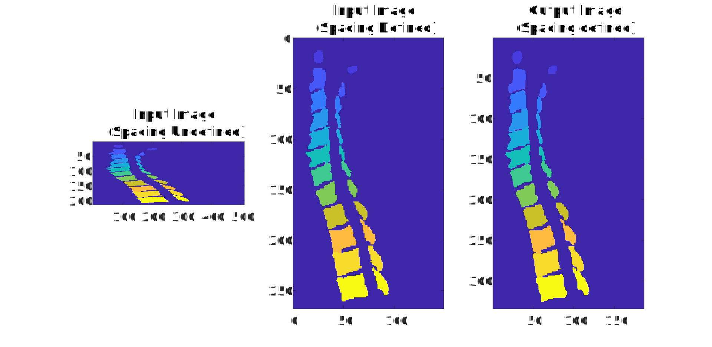

# Segmentation Upsampler

This is a Python-based software for upsampling segmented images using a mesh-based method. This method aims to reduce the staircasing artifact and increase ultrasound simulation accuracy.

## Installation

*The software is Python-based and MATLAB is used to generate sample shapes and run tests.

The software was developed in following environment:\
Python version 3.9\
MATLAB R2023b\
To use a lateral version of Python, please check the compatibility using this link: https://www.mathworks.com/support/requirements/python-compatibility.html.

Python package Installation:\
pip install numpy scipy vtk numba

MATLAB package:\
k-Wave (http://www.k-wave.org/)

## Examples

[MultilabelExample.m](https://github.com/ucl-bug/segmentation-upsampler/blob/refinedStructure/MultilabelExample.m) upsamples a code-generated complex shape and compares it to a high-resolution ground truth.

[vertrbraExample.m](https://github.com/ucl-bug/segmentation-upsampler/blob/refinedStructure/vertebraExample.m) upsamples a medical image-based segementation of a spine. Figure 1 demonstrates the upsampling of a multi-label spine segmentation with input parameters $\sigma = 0.7$ and isovalue = 0.4. The input image is sourced from Liebl $et$ $al$. 2021 [^1]. This demonstration involves upsampling at a scale of 0.8 with spacing at [0.2910, 0.2910, 1.2500]. 

*Figure 1: Mesh-based upsampling demonstration with a segmented spine (subverse003) from the Verse2020 spine segmentation dataset [^1].*

[AustinWomanKindeySliceExample.m](https://github.com/ucl-bug/segmentation-upsampler/blob/refinedStructure/AustinWomanKindeySliceExample.m) is another example that upsamples a segmented medical image. Figure 2 illustrates another example of an upsampled multi-label medical image with input parameters $\sigma = 0.4$ and isovalue = 0.4, showcasing a liver obtained from the female Visible Human Project dataset [^2]. This demonstration also involves upsampling at a scale of 0.8 with spacing at [1, 1, 1].

*Figure 2: Mesh-based upsampling demonstration with a kidney and surrounding organs from the female Visible Human Project dataset [^2].*

## Test

[MultilabelGridSearch.m](https://github.com/ucl-bug/segmentation-upsampler/blob/refinedStructure/MultilabelGridSearch.m) provides a method to find optimal parameter setting to upsample testing shapes through grid search. This code requires a high-resolution ground truth.

[methodComparsion.m](https://github.com/ucl-bug/segmentation-upsampler/blob/refinedStructure/methodComparsion.m) provides a comparsion of the mesh-based upsampling method against naive upsampling methods.

[normalizationomparsion.m](https://github.com/ucl-bug/segmentation-upsampler/blob/refinedStructure/normalizationComparsion.m) compares error metrics for evaluating the accuracy of the upsampled result. Both tested error metrics requires a high-resolution ground truth.

[IsovalueVSVolume.m](https://github.com/ucl-bug/segmentation-upsampler/blob/refinedStructure/IsovalueVSVolume.m) provides the variation of volume ratio against isovalue. This can be referred to if the user want to select isovalue automatically.

## References

[^1]:Liebl, H., Schinz, D., Sekuboyina, A., Malagutti, L., Löffler, M. T., Bayat, A., ... & Kirschke, J. S. (2021). A computed tomography vertebral segmentation dataset with anatomical variations and multi-vendor scanner data. Scientific data, 8(1), 284.
[^2]:Massey, J. W., & Yilmaz, A. E. (2016, August). AustinMan and AustinWoman: High-fidelity, anatomical voxel models developed from the VHP color images. In 2016 38th Annual International Conference of the IEEE Engineering in Medicine and Biology Society (EMBC) (pp. 3346-3349). IEEE.
