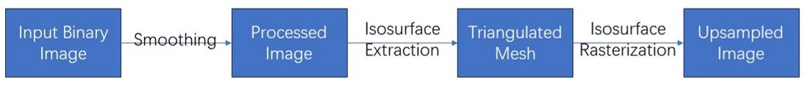
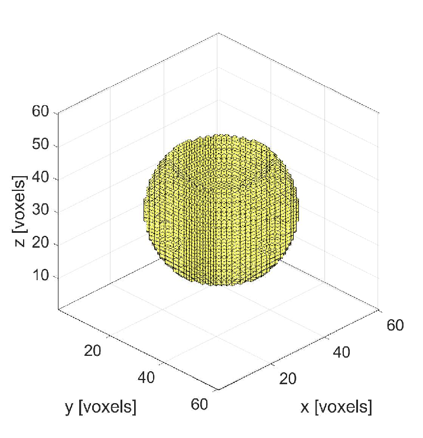
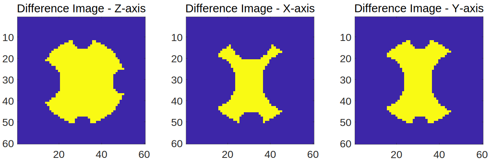
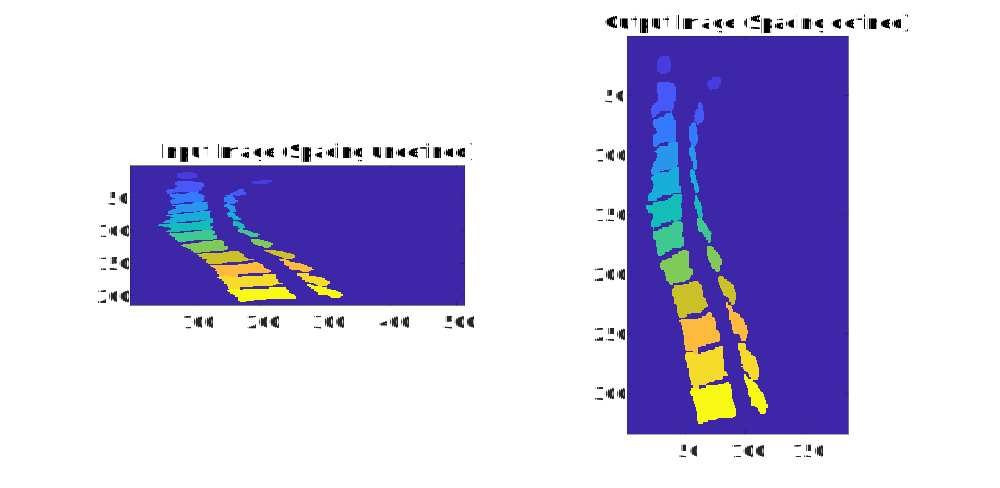

# Summary

# Statement of need

Ultrasound therapy has seen remarkable progress recently, with its applications extending from targeted cancer treatments to non-invasive brain function modulation [^1] [^2]. Such achievement is driven in part by the adoption of advanced simulation methods. These methods have enabled the focusing of ultrasound through complex media, such as the skull [cite], using techniques like phase correction [cite] and electronic focusing [cite], expand the scenario of application of ultrasound therapy.

Ultrasound simulation can provide insights into the diagnosis [cite], treatment [cite], and monitoring of various health conditions [cite]. Moreover, ultrasound stimulation can be a useful tool in personalized medicine. By conducting subject-specific simulations, we can monitor the variation of pressure and heat during medical treatment for a specific patient[^3][^4].

One of the primary limitations in patient-specific ultrasound simulation is the resolution of medical images. Medical images, such as those obtained through Magnetic Resonance Imaging (MRI) or Computed Tomography (CT) scans, can provide sufficient information for radiologists' diagnosis. However, the resolution of these images are often insufficient for accurate ultrasound simulation. In practice, an MR Image typically has a 1 mm isotropic resolution, while CT resolution is typically 0.5 mm in plane and 1-2 mm between planes. Ultrasound simulations need 6-12 grid points per wavelength, which at 500 kHz and in water or most soft tissues, corresponds to an isotropic resolution of 0.25 to 0.5 mm [^5]. During ultrasound simulation, these images are typically segmented into labels, each representing a different type of tissue or material by segmentation. Image segmentation can be completed manually, semi-automatically [cite ITK-SNAP], and now with AI models [cite]. The resulting label-map is then used to define the acoustic (and thermal) properties throughout the simulation grid. The resolution of these segmented images and the accuracy of the segmentation tends to limit simulation accuracy [^5].

An 'upsampling' process is required in order to bridge the gap between image resolution and the required simulation resolution. Naive interpolation-based upsampling methods, such as nearest neighbour or linear interpolation, may lead to 'staircasing' effects [^5]. Poor image segmentation may also lead to a staircased simulation domain and incorrect simulation results.

The challenge, therefore, lies in developing an upsampling method that can increase the resolution of segmented medical images smoothly, without introducing staircasing effects or other artifacts. The upsampling method should also be able to at least partially smooth staircasing artifacts introduced by poor image segmentation.

# Algorithm design
## Overview
This section introduces an algorithm that utilizes a mesh-based method for the process of upsampling. The workflow of the algorithm is depicted in the Fig 1.

*Figure 1: Workflow diagram*

An image with a single label can be equated to a binary image. To begin, our algorithm converts the binary image to a floaing point array, then smooths the image using a grid-based method. The purpose of the smoothing process is to add extra information, based on the assumption that a smoother surface tends to be a better assumption of the natural shape of a biological object. Next, an isosurface is extracted from the smoothed image, indicating points within a spatial volume where the values are constant.

Subsequently, the algorithm generates a triangulated free-space surface mesh grid-based isosurface. A hole-filling function will process the surface to remove redundant data. Finally, the free-space mesh is rasterized in a new grid with the required discretization for accurate ultrasound simulation.

## Input & Output
The final algorithm accepts and returns the following variables:

**Input:**
OriginalImage: low resolution input
spacing: spacing of the original image
dx: scale of upsampling (3*1 array for medical image, for instace [0.5, 0.5, 1] will upsample the image by 2 times in x and y axis and no upsampling in z axis.)
sigma: sigma for Gaussian smoother (scalar float, recommand range: 0 - 1)
I: isovalue for isosurface extraction (scalar float, recommand range: 0.4 - 0.5)

**Output:**
NewImage: high resolution output with defined spacing

While the *OriginalImage* and *dx* are required inputs from the user, the sigma and isovalue parameters may necessitate further investigation to ascertain the optimal settings. It is important to note that the choice of these parameters can significantly impact the quality of the upsampled image and the optimal parameters depend on the geometry of the segmented object.

# Application
## Test Objects

We used code-defined test objects to identify optimal sigma and isovalues for out upsampling algorithm. Our test objects include simple shapes such as a sphere, a bowl, a cylinder, and a sphere with a hole. We also have a complex object used in many tests, as shown in Figure \ref{fig:complex}. This complex object is used in all subsequent numerical experiments unless otherwise specified.

*Figure 6: 'Complex' Test Object: three-dimensional isometric projection*\label{fig:complex}

*Figure 7: 'Complex' Test Object: top view, front view and side view*\label{fig:three-view}

Objects can be generated programmatically at any desired grid resolution, so it is possible to create both low and high-resolution versions of the same test object. The sphere is generated using the k-wave toolbox [^1]. Other simple objects like a bowl and a sphere with a hole are generated by simple subtraction. A bowl is generated by subtracting a small semi-sphere from a larger one at the centre. A sphere with a hole is generated by subtracting a cylinder from a sphere at the centre. These simple objects can be imaged to represent the general shape of some anatomical structures. For instance, the bowl can be likened to a skull, the cylinder can be likened to most long bones, the sphere with a hole is similar to a vertebra, and the sphere and sphere with a hole can be used for modelling an eyeball.

The complex testing object is generated by subtracting smaller spheres from a larger sphere in six different directions. The base sphere has a radius of \(r\) and its centre is at \((0,0,0)\). Six smaller spheres with radii of \(0.75r, 0.67r, 0.5r, 0.33r, 0.25r, 0.2r\) are subtracted at \((\pm r,0,0), (0,\pm r, 0), (0,0,\pm r)\) respectively. Note that the radius used in this project is 20 voxels.

While the whole shape may not closely resemble any specific human body part, those sphere depressions of different sizes offer many sharp edges. They also provide shapes similar to a ball-socket shoulder or leg joint.

The multilabel testing object is generated by adding smaller spheres with new label at each loacation where a sphere was removed from the complex testing object. This testing object is used to evaluate the accuracy of multilabel upsampling, and is tested specifically at the interface between labels to ensure coupling between labels.

## Error Metrics

We evaluate the upsampling algorithm accuracy with a given (sigma, isovalue) parameter pair by comparing the upsampled image with the high-resolution ground truth and by calculating the number of 'incorrect' labels. This parameter will be referred to as *Diff* in the following sections. A Boolean difference matrix is obtained by comparing the result and the reference image. *Diff* is the sum of all voxels in the difference matrix. Here, the *Diff* is normalised as follows.

\[Diff = \Sigma(ref\neq out)\]

\[Grade\  by\  Volume = \frac{\Sigma(ref\neq out)}{\Sigma ref}\]

In these equations, \(\Sigma ref\) represents the volume of the high-resolution ground truth; \(A_i\) and \(\Sigma in\) represent the surface area and volume of the input image, respectively; and \textit{dx} represents the scale of upsampling.

The Grade by Volume is equivalent to the percentage of "correct" labels. The Grade by Shape relates to the complexity of the image and is independent of the reference image. These two normalization methods could lead to different conclusions when comparing different test objects. However, both of them are based on the *Diff* and will give the same conclusion when testing a single object. The following sections will focus on developing an algorithm that minimizes these two test metrics.

## Comparison against naive upsampling approach
Figure \ref{fig:upsample_methods} presents a comparison of the results obtained from different upsampling methods applied to the 'complex' testing object. Out mesh-based upsampling algorithm outperforms nearest-neighbor interpolation and trilinear interpolation across the range of tested upsampling values. This figure illustrates the variation in error against the scale of upsampling for the same object. The variable dx is the reciprocal of the scale of upsampling, meaning that a smaller dx represents a larger scale of upsampling. While some algorithms may have an advantage in upsampling particular shapes, the 'complex' test object has convex components, concave components, and edges of varying ‘sharpness’ and should serve as a fair test object for comparison across upsampling methods. 

*Figure 8: Comparison against other methods. As depicted in the figure, the trilinear interpolation method has the highest error. The performance of our mesh-based method is slightly better compared to the Nearest Neighbor method. The sudden improvement at 0.5 may be related to the rounding of the index. Note that this mesh-based method is always better than the other two methods.*

Interestingly, all three methods show a trend of decreasing error percentage as the scale of upsampling increases, especially when dx reaches 0.5. This trend may result from the normalization by volume; the number of voxels in the volume may increase faster than the number of voxels at the object interface that are difficult to upsample accurate, as the scale of upsampling increases. This nuance underscores the importance of carefully considering the impact of normalization methods on the interpretation of results.

## Demonstration
A demonstration of a medical image with \(\sigma = 0.7, isovalue = 0.4\). This demonstration upsamples at scale of 0.8 and spacing at 0.2910,0.2910,1.2500.

# Citations

# Acknowledgements

We acknowledge contributions from Brigitta Sipocz, Syrtis Major, and Semyeong
Oh, and support from Kathryn Johnston during the genesis of this project.

# References
[^1]: Bachu, E. (2021). High-Intensity Focused Ultrasound in Cancer Treatment.
[^2]: Pacini, S., & Bachu, E. (2003). Recombinant Techniques in Ultrasound Therapy.
[^3]: Xu, Y. (2024). Strategies in Ultrasound Simulation.
[^4]: Aubry, J. (2022). Benchmark for Ultrasound Simulation.
[^5]: Robertson, J. (2017). Accurate Imaging for Ultrasound Simulation.

