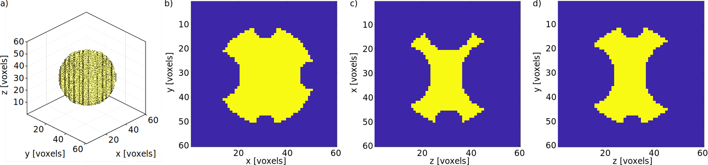
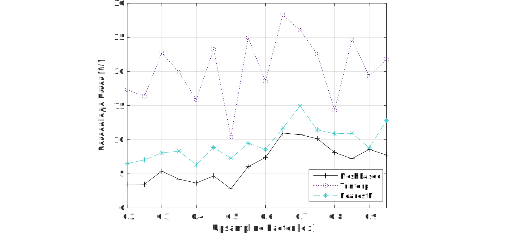

# Summary

Recent advances in ultrasound therapy are supported by improved simulation methods. Simulation methods can enhance diagnostic, therapeutic, and monitoring capabilities. A challenge in medical ultrasound simulation is the insufficient resolution of the medical images (usually MRI and CT scans) used to generate patient-specific simulation domains. Accurate patient-specific ultrasound simulation typically requires medical image upsampling, but naive upsampling methods can introduce artifacts and inaccuracies that corrupt simulation accuracy.

To address this, a new mesh-based algorithm is developed for upsampling 3-dimensional segmented medical images. The algorithm smooths the image, extracts an isosurface, generates a triangulated mesh, and rasterizes it to the required resolution. This method reduces staircasing and other upsampling artifacts, compared to traditional upsampling methods. This toolbox includes several examples including the upsampling of a complex code-based test object, and multi-labelled segmentations of a spine and a kidney with surrouding organs. This mesh-based upsampling approach may enhance ultrasound simulation accuracy in personalized medicine.

# Statement of need

Therapeutic ultrasound applications extend from targeted cancer treatment to non-invasive deep brain neuromodulation [^1] [^2]. The development and success of new therapeutic ultrasound applications is often enabled by adoption of advanced simulation methods [^3]. For example, ultrasound neuromodulation is developing as a tool in personalized medicine. Subject-specific simulations can be used to estimate treatment pressures and heating, giving confidence in the safety and efficacy of the treatment[^2][^4]. Subject-specific simulations may also be used to calculate transducer element phase and amplitude corrections[^2] or to design acoustic holograms [^5] for focusing through aberrating media such as the skull.

One limitation in patient-specific ultrasound simulation is medical image resolution. The resolution of a clinical magnetic resonance image is typically 1 mm (isotropic), while x-ray computed tomography resolution is typically 0.5 mm in plane and 1-2 mm between planes. Accurate grid-based ultrasound simulations typically require 6-12 grid points per wavelength, which at the commonly utilized ultrasound frequency of 500 kHz and in water or most soft tissues, corresponds to an isotropic resolution of 0.25 to 0.5 mm [^6]. Prior to ultrasound simulation, these images are typically segmented into labels, with each label representing a different type of tissue or material. Image segmentation can be completed manually, semi-automatically [^7], and now with artificial intelligence methods [^8]. The resulting label-map is then used to define the acoustic (and thermal) properties throughout the simulation grid. The resolution of these segmented images and the accuracy of the segmentation tends to limit simulation accuracy [^6].

An 'upsampling' process is required to bridge the gap between image resolution and the required simulation resolution. However, naive interpolation-based upsampling methods, such as nearest neighbour or linear interpolation, may lead to 'staircasing' effects at a detriment to simulation accuracy [^6]. Poor image segmentation may also lead to a staircased simulation domain and inaccurate simulation results.

The challenge lies in developing an upsampling method that can increase the resolution of segmented medical images smoothly, without introducing staircasing effects or other artifacts. The upsampling method should also be able to partially smooth staircasing artifacts introduced by poor image segmentation.

# Algorithm design
## Overview

*Figure 1: The input 3D image is binarized, then smoothed with a Gaussian smoothing kernel to create a 3D floating point array. A mesh is then generated and improved using python VTK, before being rasterized to the target resolution to create the upsampled image.*

This section introduces an algorithm that utilizes a mesh-based method for the upsampling process. The workflow of the algorithm is depicted in Figure 1. An image with a single label can be equated to a binary image. To begin, the algorithm converts the binary image to a floaing point array, then smooths the image using a Gaussian smoothing kernel. Smoothing is implemented on the basis that smooth surfaces are a better approximation of the natural shape of a biological object. Next, an isosurface is extracted from the smoothed image, generated from points within the volume with a constant value. Subsequently, the algorithm generates a triangulated free-space surface mesh isosurface. A hole-filling function is implemented to improve the mesh quality. Finally, the free-space mesh is rasterized to the output grid with the required discretization for accurate ultrasound simulation.

The workflow described above applies to the upsampling of a binary image. The algorithm is repeated for each label in a segmented medical image with multiple labels. However, multi-label upsampling introduces a new challenge: gaps with missing labels and overlapping segmentations at the boundaries between different labels. The algorithm handles overlaps by sorting the input labels by volume. The algorithm then starts the upsampling process with the largest volume, then repeatedly overwrites the output with the following smaller volumes. Gaps with missing labels are addressed with the careful selection of the isovalue to ensure that the volume enclosed by the isosurface is slightly larger than the original volume. The impact of isovalue selection is displayed in Figure 2. The toolbox also includes an optional hole-filling post-processing step that enables users to choose lower isovalues and close gaps between labels in a multi-label image. The post-processing checks the value of an empty voxel in each of the smoothed label matrices and the empty voxel is filled with the value of the highest smoothed label matrix. 

*Figure 2: Multi-label upsampling requires a balance between Gaussian smoothing level and isovalue selection in order to accurately create the mesh interface. A high isovalue e.g., a) 0.6 leaves gaps between labels after mesh creation. b) An isovalue of 0.5 is optimal in 1D but may leave gaps in 3D. c) A low isovalue (e.g., 0.4) reduces gaps but will result in biased label 1 or 2 volumes.*

# Application

We used the code-defined test object displayed in Fig. 3 to identify optimal $\sigma$ and $I$ values. The test object is generated by subtracting smaller spheres from a larger sphere. Spheres are generated using the $makeSphere$ function from the k-Wave[^9] acoustic simulation toolbox. The base sphere has a radius of $r$ and is centered at $(0,0,0)$. Six smaller spheres with radii of $0.75r, 0.67r, 0.5r, 0.33r, 0.25r, 0.2r$ are subtracted at $(\pm r,0,0), (0,\pm r, 0), (0,0,\pm r)$ respectively. The radius $r$ was set to 20 voxels. The spherical subtractions from the base sphere generate sharp edges, similar to certain bony anatomical features that need to be preserved during upsampling for simulation accuracy. Some upsampling algorithms may have an advantage in upsampling simple geometric shapes. To counteract this, the test object has convex components, concave components, and edges of varying ‘sharpness’, with the aim of representing a broad range of possible biological features. 

*Figure 3: 'Complex' Test Object: three-dimensional isometric projection, b) top view, c) front view, and d) side view of the complex test object.*

We evaluate the upsampling algorithm accuracy with a given $(\sigma, isovalue)$ parameter pair by comparing the upsampled image ($out$) with the high-resolution ground truth ($ref$). A Boolean difference matrix of the two images is used to obtain the number of erroneous labels. The percentage error is then obtained by normalising the number of erroneous labels by the volume of the high-resolution ground truth.

$$%Error = 100 \times \frac{\Sigma(ref\neq out)}{\Sigma ref}\$$

Figure 4 presents a comparison of the results obtained from two commonly-used upsampling methods (nearest-neighbor interpolation and trilinear interpolation) and our mesh-based upsampling method. Our mesh-based upsampling algorithm (with $\sigma = 0.68, I = 0.513$) outperforms nearest-neighbor interpolation and trilinear interpolation across the range of tested upsampling values.

*Figure 4: Percentage upsampling error for the mesh-based upsampling algorithm versus two naive upsampling algorithms: trilinear and nearest-neighbour upsampling. The errors are evaluated across a range of upsampling scales.*

# Acknowledgements

This work was supported in part by a UKRI Future Leaders Fellowship (Grant MR/T019166/1) and in part by the Wellcome/EPSRC Centre for Interventional and Surgical Sciences (WEISS) (No. 203145Z/16/Z). For the purpose of open access, the author has applied a CC BY public copyright licence to any Author Accepted Manuscript version arising from this submission. 

# References
[^1]: Vidal-Jove, J., Serres, X., Vlaisavljevich, E., Cannata, J., Duryea, A., Miller, R., ... & Ziemlewicz, T. J. (2022). First-in-man histotripsy of hepatic tumors: the THERESA trial, a feasibility study. International Journal of Hyperthermia, 39(1), 1115-1123.
[^2]: Martin, E., Roberts, M., Grigoras, I. F., Wright, O., Nandi, T., Rieger, S. W., ... & Treeby, B. E. (2024). Ultrasound system for precise neuromodulation of human deep brain circuits. bioRxiv, 2024-06.
[^3]: Aubry, J. F., Bates, O., Boehm, C., Butts Pauly, K., Christensen, D., Cueto, C., ... & Van't Wout, E. (2022). Benchmark problems for transcranial ultrasound simulation: Intercomparison of compressional wave models. The Journal of the Acoustical Society of America, 152(2), 1003-1019.
[^4]: Xu, R., Bestmann, S., Treeby, B. E., & Martin, E. (2024). Strategies and safety simulations for ultrasonic cervical spinal cord neuromodulation. Physics in Medicine and Biology.
[^5]:Jiménez-Gambín, S., Jiménez, N., Benlloch, J. M., & Camarena, F. (2019). Holograms to focus arbitrary ultrasonic fields through the skull. *Physical Review Applied, 12*(1), 014016.
[^6]: Robertson, J. L., Cox, B. T., Jaros, J., & Treeby, B. E. (2017). Accurate simulation of transcranial ultrasound propagation for ultrasonic neuromodulation and stimulation. The Journal of the Acoustical Society of America, 141(3), 1726-1738.
[^7]:Yushkevich, P. A., Gao, Y., & Gerig, G. (2016, August). ITK-SNAP: An interactive tool for semi-automatic segmentation of multi-modality biomedical images. In 2016 38th annual international conference of the IEEE engineering in medicine and biology society (EMBC) (pp. 3342-3345). IEEE.
[^8]:Milletari, F., Navab, N., & Ahmadi, S. A. (2016, October). V-net: Fully convolutional neural networks for volumetric medical image segmentation. In 2016 fourth international conference on 3D vision (3DV) (pp. 565-571). IEEE.
[^9]:B. E. Treeby and B. T. Cox, "k-Wave: MATLAB toolbox for the simulation and reconstruction of photoacoustic wave-fields," J. Biomed. Opt., vol. 15, no. 2, p. 021314, 2010.
[^10]:Liebl, H., Schinz, D., Sekuboyina, A., Malagutti, L., Löffler, M. T., Bayat, A., ... & Kirschke, J. S. (2021). A computed tomography vertebral segmentation dataset with anatomical variations and multi-vendor scanner data. Scientific data, 8(1), 284.
[^11]:Massey, J. W., & Yilmaz, A. E. (2016, August). AustinMan and AustinWoman: High-fidelity, anatomical voxel models developed from the VHP color images. In 2016 38th Annual International Conference of the IEEE Engineering in Medicine and Biology Society (EMBC) (pp. 3346-3349). IEEE.
